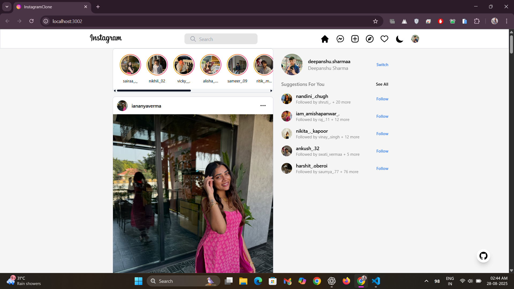
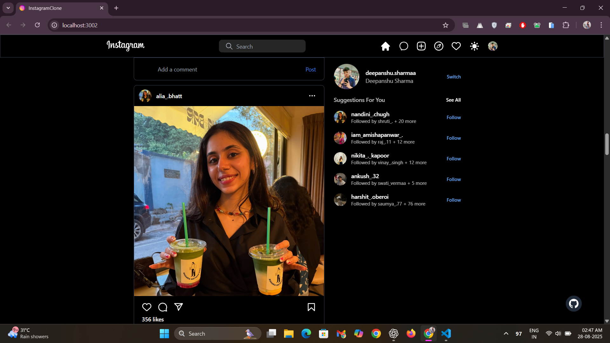
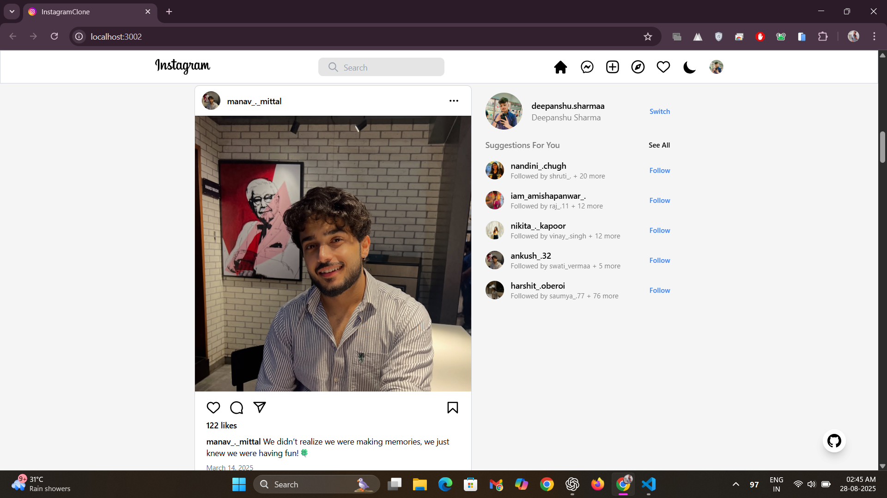
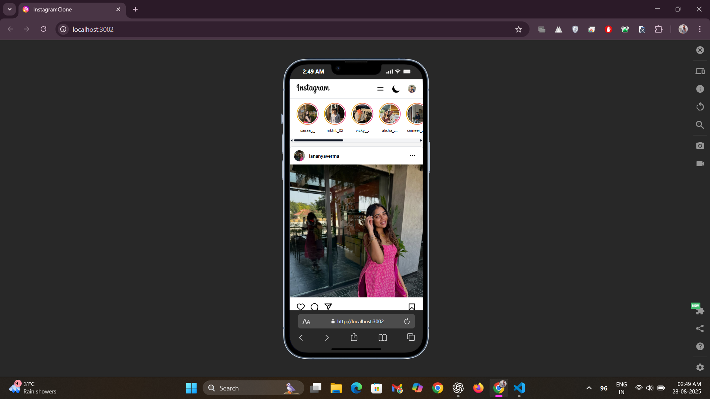

# 📸 Instagram UI Clone


**A responsive Instagram-inspired UI for photo sharing with post creation, likes, and comments — frontend only.**  

**Live Demo:** [Instgram Clone](https://insta-clone-online.netlify.app/)

---

## 🌟 Overview
This project is a clean, mobile-first Instagram UI clone built with **React, TypeScript, and Tailwind CSS**. It simulates core interactions like creating posts, liking, and commenting on the client side. The UI is designed to be **minimal, responsive, and accessible**, closely following Instagram's official design.

---

## ⚡ Features
- **Post creation UI:** Add images and captions with preview.  
- **Like & comment simulation:** Interact with posts (no persistent storage).  
- **Dynamic feed:** New posts appear instantly.  
- **Responsive layout:** Flexbox/Grid for desktop and mobile.  
- **Clean UX:** Minimal, accessible, and consistent components.  

---

## ✨ Highlights
- Tried to replicate the UI/UX as closely as possible to the real Instagram.  
- Fully responsive on **mobile phones**, tablets, and desktops.  
- Inspired by **Instagram by Meta**, with attention to visual details, typography, and spacing.  
- Built with scalability in mind, easy to integrate a backend or additional features later.  

---

## 🖼 Screenshots

<details>
<summary>Desktop Screenshots</summary>

### Home Light Mode
  
*Home page in light mode with full desktop layout.*

### Home Dark Mode
  
*Home page in dark mode for desktop users.*

### Home Feed Example
  
*Example of posts with likes and comments.*

</details>

<details>
<summary>Mobile Screenshots</summary>

### Mobile Responsive View
  
*Fully responsive mobile layout, optimized for small screens.*

</details>

---

## 🛠 Installation
```bash
# Clone the repository
git clone <your-repo-link>

# Go to the project folder
cd InstagramClone

# Install dependencies
npm install

# Start the dev server
npm run dev
