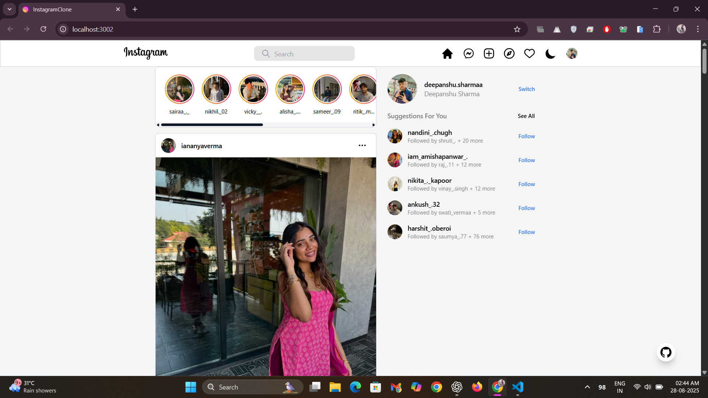
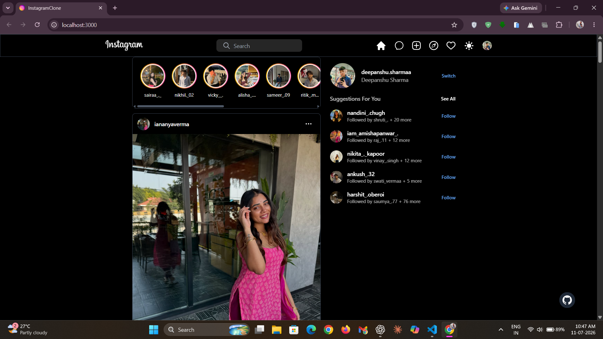
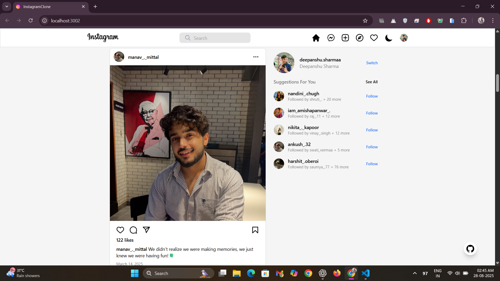
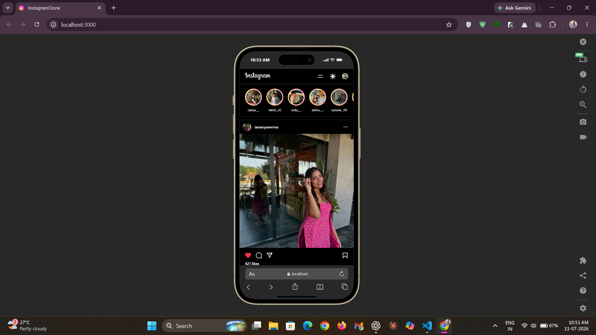

# 📸 Instagram Clone


  

- This application is a clean, mobile-first Instagram UI clone that faithfully recreates the look and feel of `Instagram's official design` with a pixel-perfect, theme-aware interface. 
- It features interactive post liking, seamless light and dark mode switching, fully responsive layouts, smooth user interactions, and a modern, intuitive user experience with meticulous attention to visual details, spacing, and typography.

**🌐 Explore the Instagram-style interface in action :** [Live Demo](https://instawebclone.vercel.app/)

## ⚡ Features

- **📸 Post creation UI:** Add images and captions with preview.  
- **❤️ Like & comment simulation:** Interact with posts (no persistent storage).  
- **📰 Dynamic feed:** New posts appear instantly.  
- **📱 Responsive layout:** Flexbox/Grid for desktop and mobile.  
- **🔥 Clean UX:** Minimal, accessible and consistent components.  

## ✨ Highlights

- 🎯 Tried to replicate the UI/UX as closely as possible to the real Instagram.  
- 📱 Fully responsive on **mobile phones**, tablets and desktops.  
- 🎨 Inspired though **"Instagram by Meta"**, with attention to visual details, typography and spacing.  
- 🌗 Light/Dark theme toggle in the navbar for seamless theme switching.
- 💖 Interactive **Like functionality** for posts with instant UI updates.
- 🚀 Built with scalability in mind, easy to integrate a backend or additional features later.  

## 🖼 Screenshots / Demo

> Take a look at some screenshots showcasing the website.

### ☀️ Home (Light Mode)

  
*Full desktop layout with bright, clean and intuitive design.*

### 🌙 Home (Dark Mode)
  
*Optimized desktop layout with visually comfortable dark theme.*

### ❤️ Home Feed Example
  
*Showcases posts with likes and comments for a realistic social media experience.*

### 📱 Mobile Responsive View

  
*Fully responsive mobile layout, optimized for small screens.*

## 🛠 Tech Stack Used

- **⚛️ Frontend:** React v18, TypeScript, Tailwind CSS  
- **🧩 UI Components:** Heroicons  
- **🎨 Styling & Build Tools:** PostCSS, Vite  
- **🏗️ Concepts Used:** Responsive UI/UX, Component-Based Architecture  
- **📦 Version Control:** Git, GitHub
- **🔗 Deployment:** Vercel 

## ⚙️ Setup and Installation

> To set up and run the project locally, follow these steps below:

### 1️⃣ Clone the Repository

```bash
git clone https://github.com/deepanshu1420/InstagramClone.git
```

### 2️⃣ Navigate to the project directory

```bash
cd InstagramClone
```

### 3️⃣ Install Dependencies

Make sure you have `Node.js` installed, then run:

```bash
npm install
```

### 4️⃣ Start the Development Server

```bash
npm run dev
```

✅ **That's it!** The project should now be running locally at:

```text
http://localhost:3000
```

Open the URL in your browser and start exploring a seamless `Instagram-inspired` social media interface. ☄️
